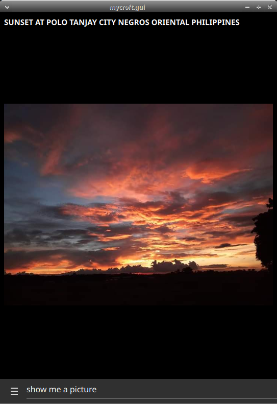
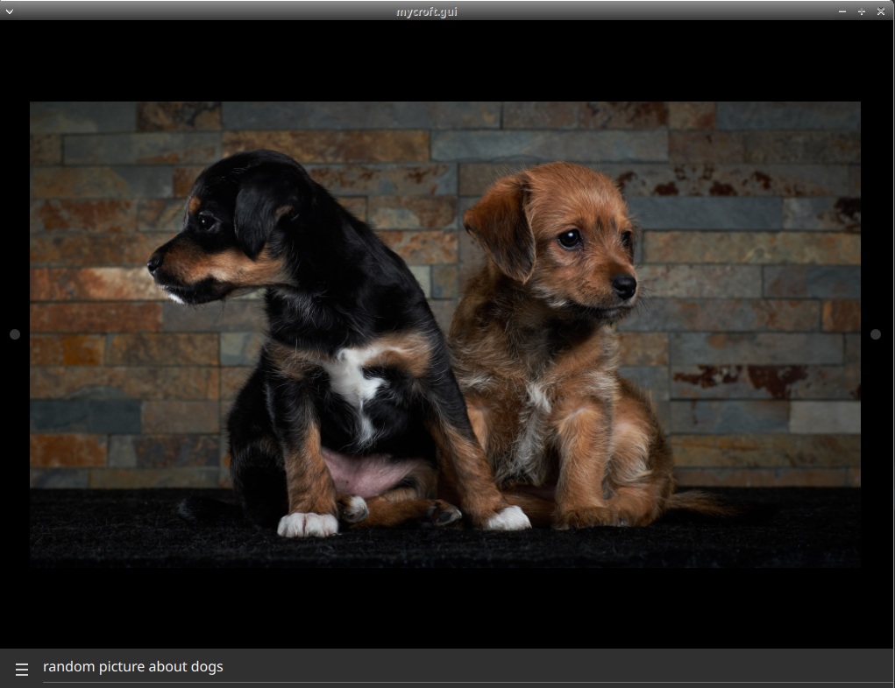
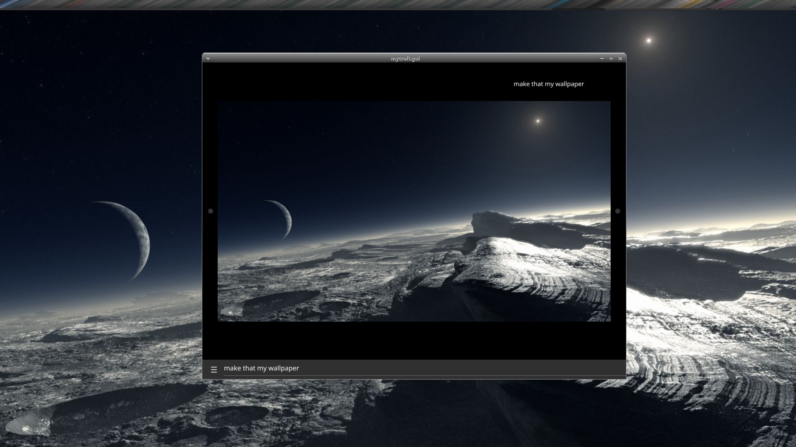

#  Wallpaper Changer

Pictures from selected subreddits

## Examples
* "new wallpaper"
* "change wallpaper to nature"
* "show me a picture"
* "show me a picture with dogs"
* "make that my wallpaper"
